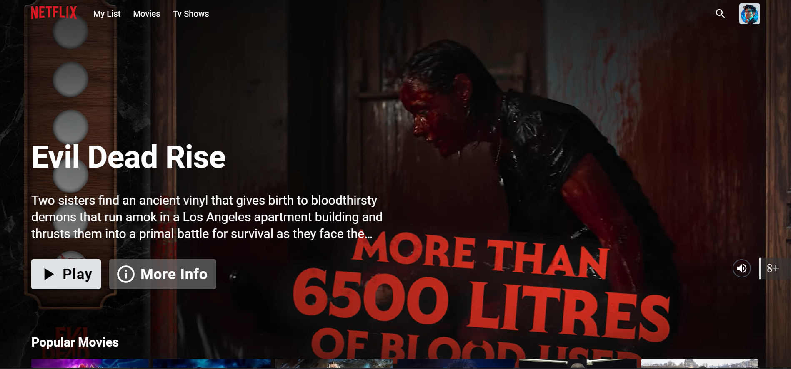
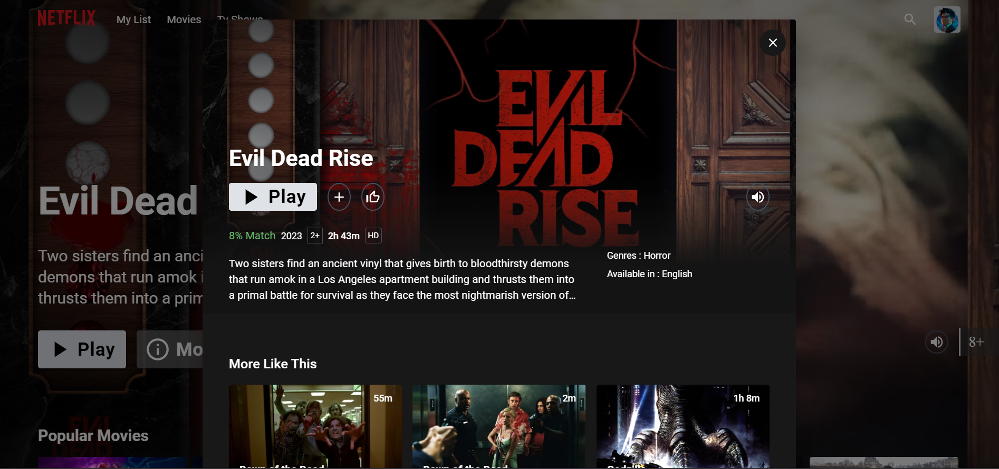

## Hi every one
This page is a movie web application that displays all trending or high-rated movies and series in detail and has the ability to search for all movies. This page is fully responsive and has the ability to change the theme. React router dam bend is used.

## Third Party libraries used except for React and RTK

- [MUI(Material UI)](https://mui.com/)
- [framer-motion](https://www.framer.com/docs/)
- [video.js](https://videojs.com)
- [react-slick](https://react-slick.neostack.com/)

## Demo

  
  
Home Page

  
  
Detail

